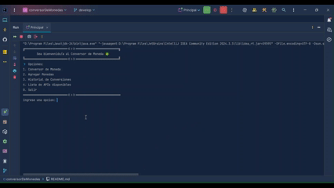

   
   

Aplicación de consola en Java que permite convertir monedas en tiempo real utilizando distintas APIs públicas. El sistema está diseñado con principios de programación orientada a objetos.

## :floppy_disk: ¿Cómo lo descargo?
Clona el repositorio.
```bash
  git clone https://github.com/AbelIbarraSol/conversorDeMonedas.git
```
o [:arrow_down: Descarga el proyecto](https://github.com/AbelIbarraSol/conversorDeMonedas/archive/refs/heads/main.zip) y descomprimelo.

## :point_up::sunglasses: ¿Cómo usarlo?

1. Abre el proyecto con IntelliJ IDEA o tu IDE favorito.
2. Ejecuta el proyecto.
3. Selecciona la opción **[ 4. Lista de APIs disponibles ]**.
4. Escoge la API que deseas usar.
5. Registra la API Key, seleccionando la opcion **[ 2. Registrar o modificar KEY ]**.
6. Marca la API como predeterminada para poder realizar conversiones, selecciona la opción **[ 3. Seleccionar como API predeterminada ]**. 

## ¿Qué cosas puedo hacer con Money Strange?
1. Convertir monedas usando la API de Exchange de tu preferencia.<br>

2. Agregar las monedas de tu preferencia.<br>

3. Visualizar el historial de las conversiones que has realizado.<br>


## :clipboard: Requisitos previos
- Java 17 o superior.
- IntelliJ IDEA (o cualquier IDE que soporte proyectos Java).
- Conexión a Internet (para acceder a las APIs).
- API Key de [ExchangeRate](https://www.exchangerate-api.com/) o [OpenExchangeRates](https://openexchangerates.org/).

## :coffee: Tecnologías usadas en el proyecto
- Java 24 2025-03-18
- Libreria Gson 2.13.1 
- [ExchangeRate](https://www.exchangerate-api.com/)
- [OpenExchangeRates](https://openexchangerates.org/)
- IntelliJ IDEA 2025.1.3 (Community Edition)

## ⚖ Licencia
El presente proyecto esta bajo la licencia del [MIT](https://choosealicense.com/licenses/mit/)

## :heart: Agradecimientos
El presente proyecto fue creado para el Challenge Conversor de Monedas del Programa Oracle Next Education (ONE) con la ayuda y guia de [@AluraLatam](https://www.linkedin.com/school/alura-latam/posts/?feedView=all)

## 👨‍💻 Autor
[@AbelIbarraSol](https://github.com/AbelIbarraSol) aka **MrStrange**.

## :raised_hands: Contribuciones

¡Tus contribuciones son bienvenidas :heart:!<br>Puedes hacer un fork del repositorio y enviar un pull request.
